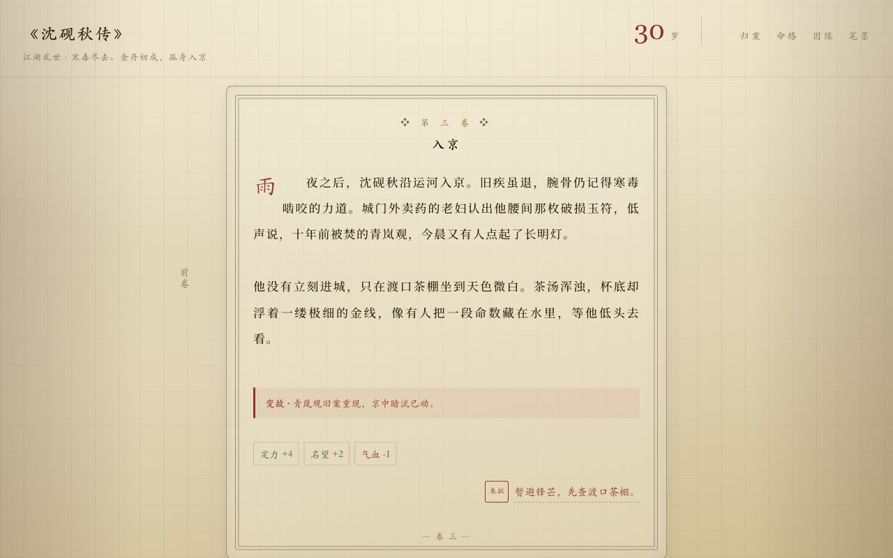

# 人生之书

一款可静态部署的纯文字人生沙盒。玩家从一卷空白书页开始，由 AI 扮演命运主持人，随机生成世界、身份、关系与变故；每一次抉择都会推进人生，并最终封存为书柜中的一册旧卷。
（AI驱动的人生重开模拟器）

## 在线体验

[https://vioaki.github.io/life-weaver-bookshelf/](https://vioaki.github.io/life-weaver-bookshelf/)

## 展示

| 书案入口 | 藏书阁 |
| --- | --- |
|  |  |

| 详阅书卷 | 阅读长卷 |
| --- | --- |
|  |  |

## 特性

- AI 驱动的人生模拟：随机开局、长期推进、关系变化、突发事件与终章总结。
- 书柜式存档：每段人生都会成为一本书，可续写、翻阅、查看终章或焚毁。
- 沉浸式阅读：正文采用长卷排版，选项自然生长在书页末尾。
- 流式叙事：模型输出时呈现湿墨书写状态，完成后转为干透正文，避免二次闪烁。
- 本地优先：书柜存档写入 IndexedDB，接口配置保存在 localStorage。
- 静态部署：Vite 构建后可直接部署到 GitHub Pages 等静态托管平台。

## 本地运行

```bash
npm install
npm run dev
```

默认开发地址：

```text
http://127.0.0.1:5173/
```

## 接口配置

应用不内置 API Key。首次点击「起新卷」时，如果尚未配置接口，会打开「笔墨」设置。

需要填写：

- `接口地址`：兼容 OpenAI Chat Completions 的接口地址，例如 `https://api.openai.com/v1`
- `API Key`：仅保存在当前浏览器本地
- `模型名称`：例如 `gpt-5.5`
- `笔锋` 与 `命运批注`：用于调整叙事风格和额外世界观设定

模型接口需要支持流式 `chat/completions` 返回。

## 构建

```bash
npm run build
```

构建产物输出到 `dist/`。项目使用相对路径资源，适合部署到 GitHub Pages。

## 数据与安全

- 书柜数据保存在浏览器 IndexedDB。
- 接口配置保存在浏览器 localStorage。
- API Key 不会写入源码，也不会随构建产物生成。
- 公开部署后，访问者需要在自己的浏览器中填写自己的接口配置。
- 清理浏览器站点数据会删除本地书柜与接口设置。

## 技术栈

- Vite
- TypeScript
- 原生 DOM、CSS 与 IndexedDB
- OpenAI-compatible streaming Chat Completions API
